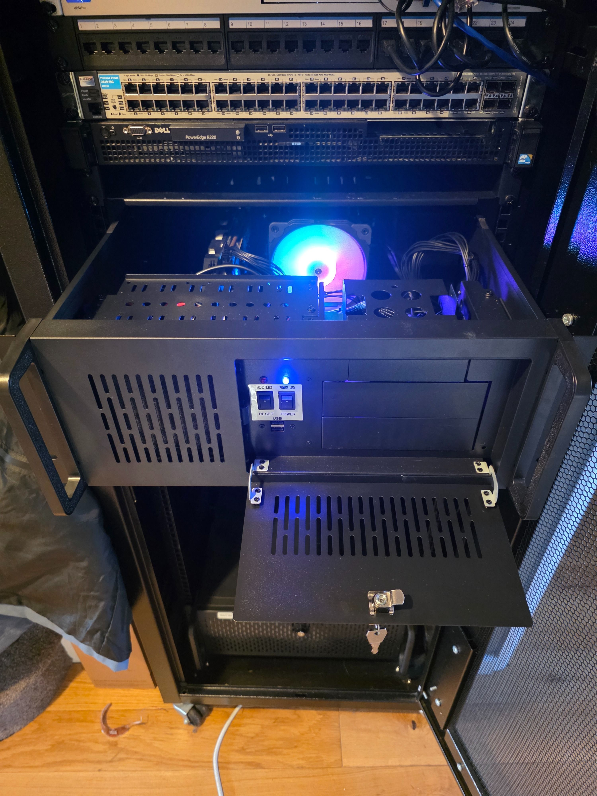
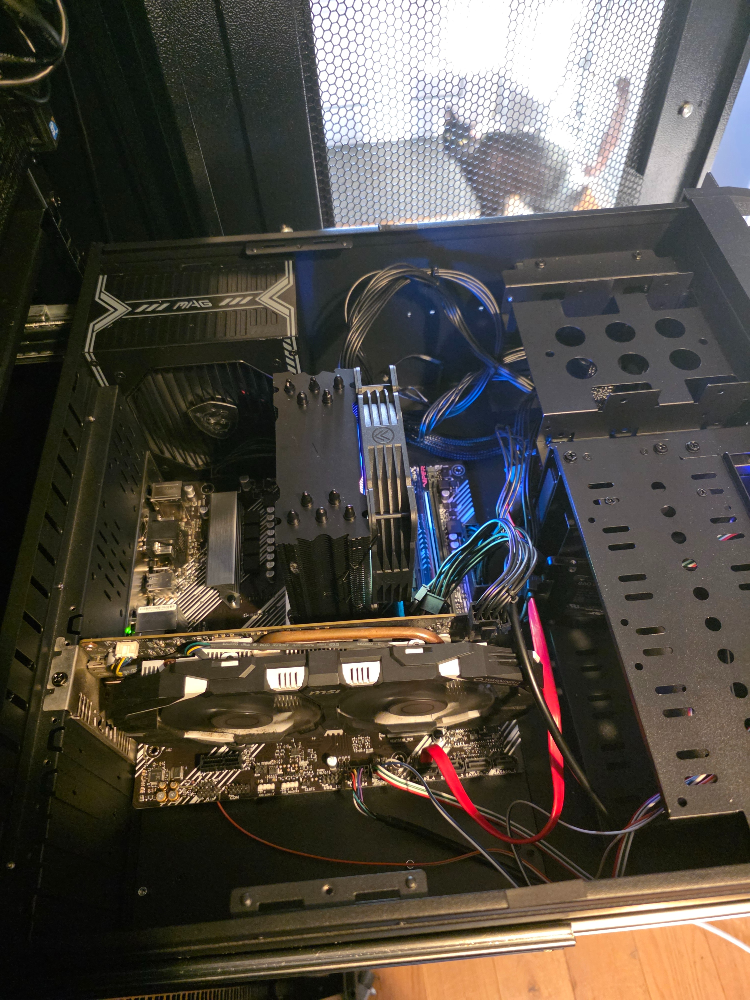
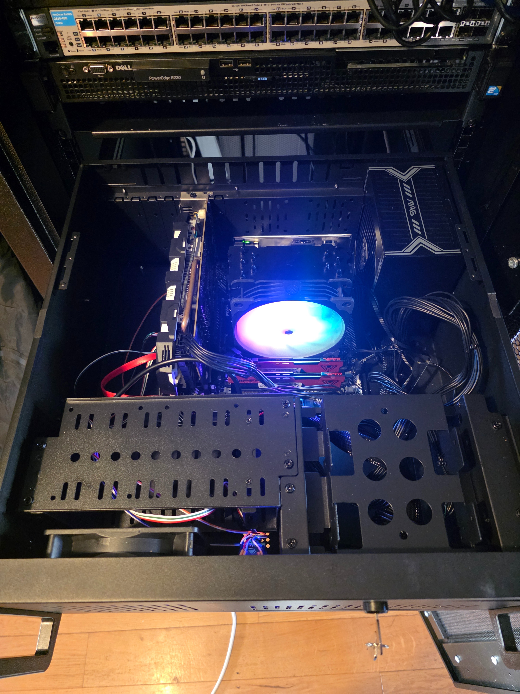

# Proxmox

The server I use to run most things in my Homelab (including this website!), and anything that I can throw at it.

## Server Specs

- CPU: AMD Ryzen 7 5800x
- GPU: NVIDIA GeForce GTX 1060
- RAM: 64GB DDR4

## Storage

- 1x Samsung 860 EVO 256GB (Boot Drive)
- 1x Crucial P3 1TB (Containers / VMs)

## Images

