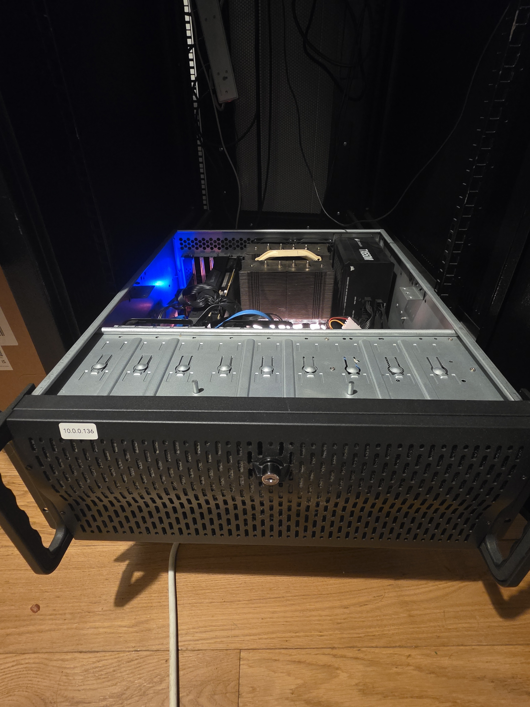
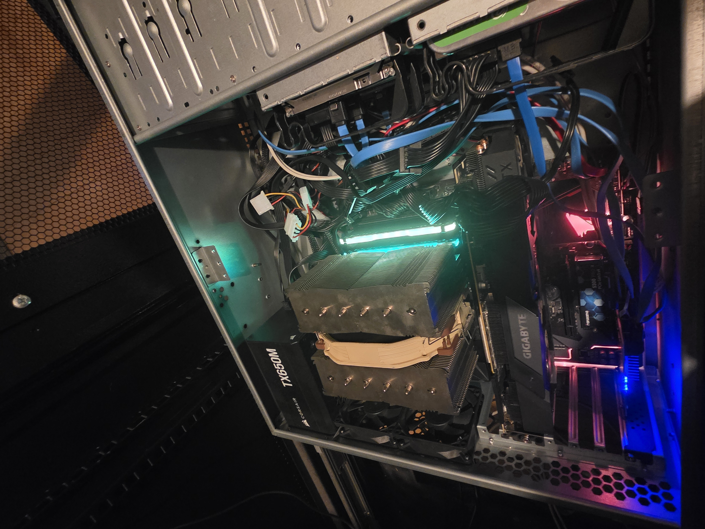
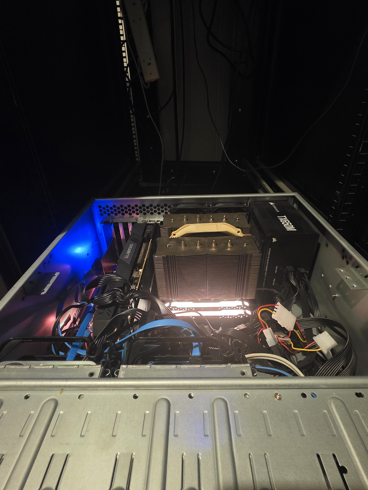

# Unraid NAS

My mass storage machine to store basically my entire life.

## Server Specs

- CPU: AMD Ryzen 3200
- GPU: NVIDIA GeForce RTX 2070 Super (8GB)
- RAM: 32GB DDR4
- Motherboard: Gigabyte B450 AORUS ELITE
- Case: Codegen V2 600mm 4U
- PSU: Corsair TX650M

## Storage

### Cache

- 1x Fiaxang S500 Pro 256GB

### Mass Storage

- 1x Seagate 16TB (Exos X16)
- 1x Seagate 16TB (IronWolf Pro)
- 1x Western Digital 6TB (WD Purple)

## Images

