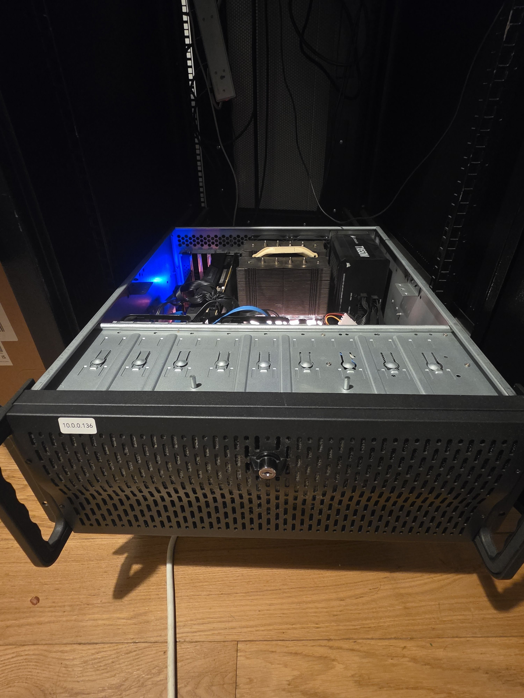
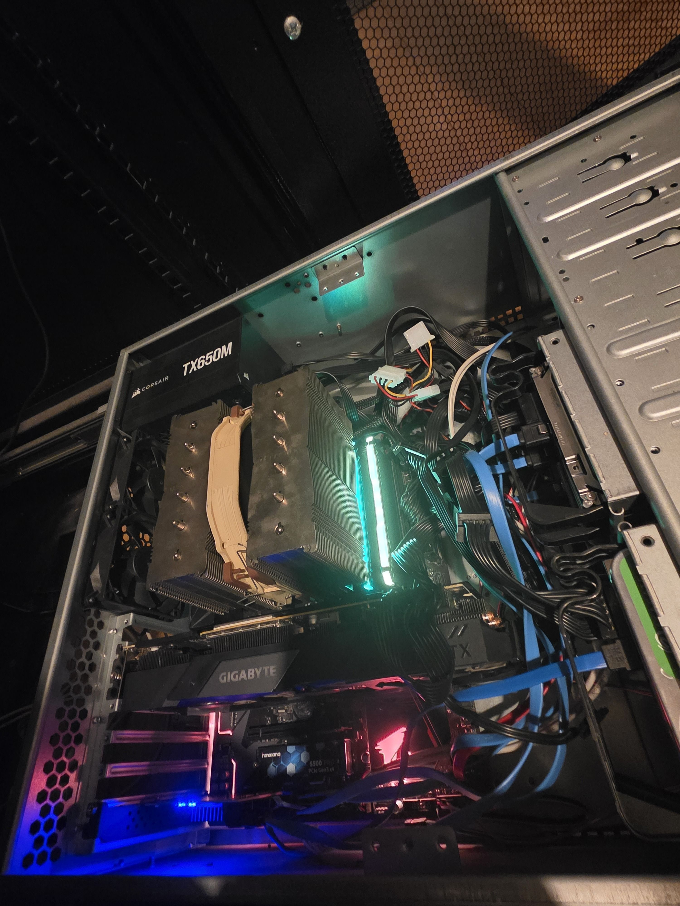
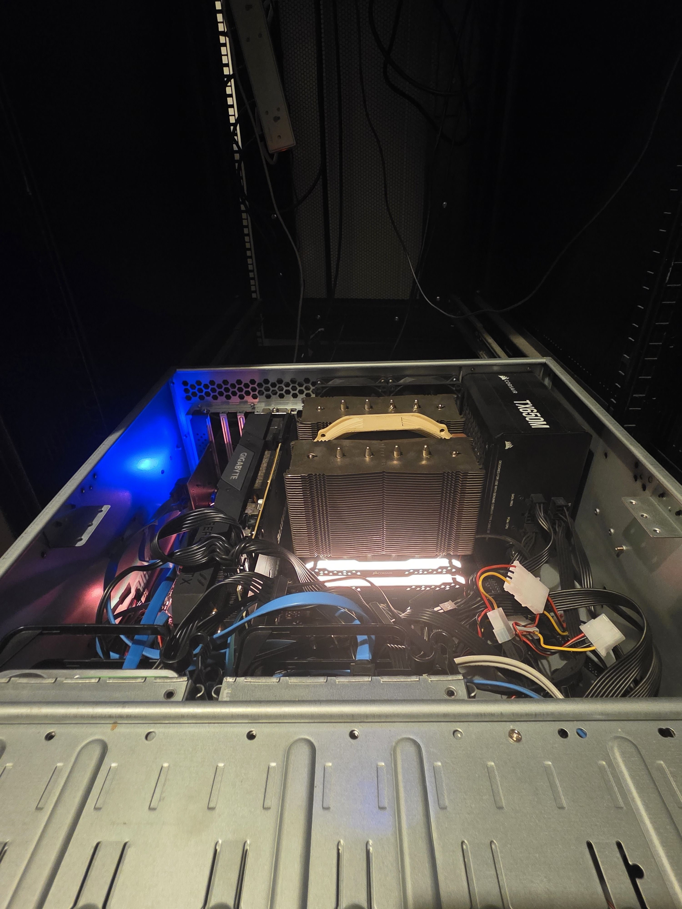

# Unraid NAS

My mass storage machine to store basically my entire life.

## Server Specs

- CPU: AMD Ryzen 3600
- GPU: 5050Ti 16GB
- GPU: 3060 12GB
- RAM: 32GB DDR4
- Motherboard: Gigabyte B450 AORUS ELITE
- Case: Codegen V2 600mm 4U
- PSU: Corsair TX650M

## Storage

### Cache

- 1x Fanxiang S500 Pro 1TB (ZFS pool: cache)

### Apps

- 1x WD PC SN530 512GB (ZFS pool: apps)

### Mass Storage

- 1x Seagate 16TB (IronWolf Pro, Parity)
- 1x Seagate 16TB (Exos X16)
- 1x Western Digital 14TB (Ultrastar DC HC530)
- 1x Western Digital 6TB (WD Purple)

## Images

*Note: These images are outdated and no longer reflect the current build.*

