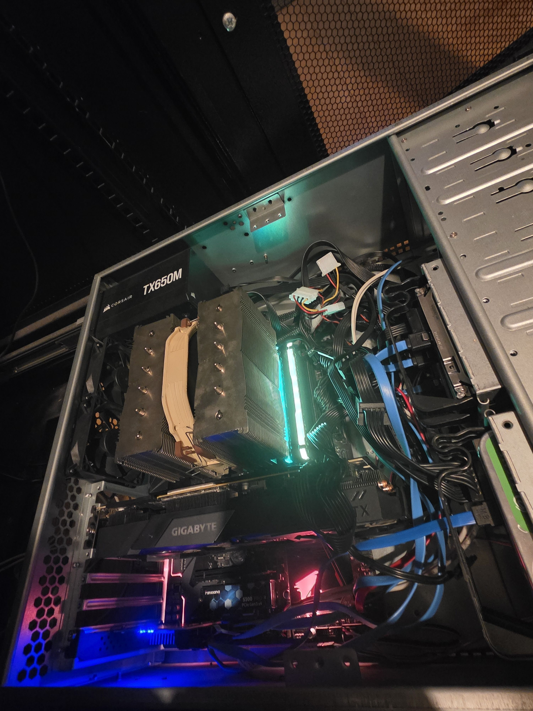

# Unraid NAS

## Server Specs

- CPU: AMD Ryzen 3200
- RAM: 32GB DDR4
- Motherboard: Gigabyte B450 AORUS ELITE
- Case: Codegen V2 600mm 4U

## Storage

- 1x Seagate 16TB (Exos X16)
- 1x Seagate 16TB (IronWolf Pro)
- 1x Western Digital 6TB (WD Purple)

## Images

