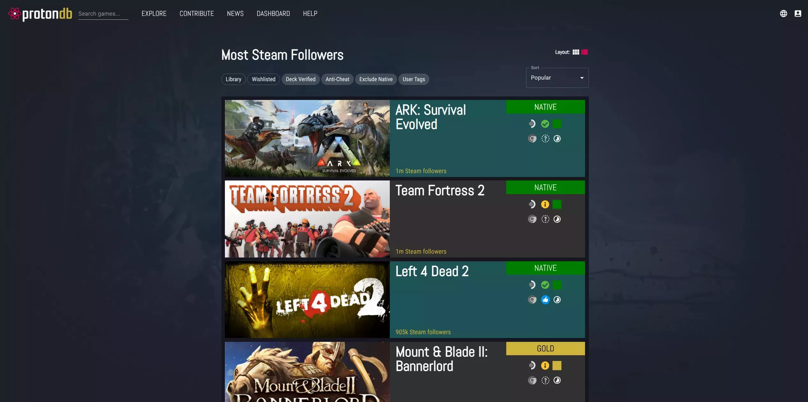

# Gaming on CachyOS: Steam & Proton Guide

Welcome to the ultimate guide for gaming on CachyOS! This comprehensive resource will help you set up and optimize your Linux gaming experience using Steam and Proton. Whether you're new to Linux gaming or looking to improve your current setup, this guide covers everything from basic installation to advanced performance optimization.

## What is Proton?

[Proton](https://github.com/ValveSoftware/Proton) and it's many forks are a compatibility layer for running Windows games on Linux using Wine. It combines various technologies like DXVK, VKD3D-Proton, and Wine to provide a seamless gaming experience on Linux.

## Table of Contents

- [Installing Drivers](/wiki/cachyos/gaming/installing-drivers)
- [Configuring Steam](/wiki/cachyos/gaming/configuring-steam)
- [Proton](/wiki/cachyos/gaming/proton)
- [Performance Monitoring](/wiki/cachyos/gaming/performance-monitoring)
- [Game Optimization](/wiki/cachyos/gaming/game-optimization)
- [Ananicy Cpp](/wiki/cachyos/gaming/ananicy-cpp)
- [Anticheat Support](/wiki/cachyos/gaming/anticheat)

## ProtonDB

[ProtonDB](https://www.protondb.com/) is a database of game compatibility reports for Proton. You can find the best launch options for your game by searching for your game on the website.

## Troubleshooting Common Gaming Issues

### Game Launch Problems

1. **Game Crashes on Launch**
   - Try different Proton versions
   - Verify game files in Steam
   - Check system logs for errors
   - Disable shader pre-caching

### Performance Optimization

2. **Poor Performance**
   - Ensure you have the latest graphics drivers
   - Check if your GPU is being properly utilized
   - Monitor system resources using MangoHud
   - Try different launch options
   - Enable [GameMode](#gamemode)

### Audio Configuration

3. **Audio Issues**
   - Verify PulseAudio or Pipewire is running
   - Check if the game is using the correct audio device
   - Try different audio settings in the game
   - Check for audio device conflicts

## Essential Gaming Resources

- [ProtonDB](https://www.protondb.com/) - Check game compatibility and user reports
- [Lutris](https://lutris.net/) - Alternative game manager with additional features
- [WineHQ](https://www.winehq.org/) - Wine documentation and compatibility database
- [Gaming on Linux](https://www.gamingonlinux.com/) - News and guides for Linux gaming
- [Steam Linux Runtime](https://github.com/ValveSoftware/steam-runtime) - Steam's runtime environment
- [DXVK](https://github.com/doitsujin/dxvk) - DirectX to Vulkan translation layer
- [VKD3D-Proton](https://github.com/HansKristian-Work/vkd3d-proton) - DirectX 12 to Vulkan translation layer

## Contributing

If you have any suggestions or feedback for this gaming resource, please feel free to open an issue or submit a pull request on the [GitHub repository](https://github.com/realfascinated/wiki).
