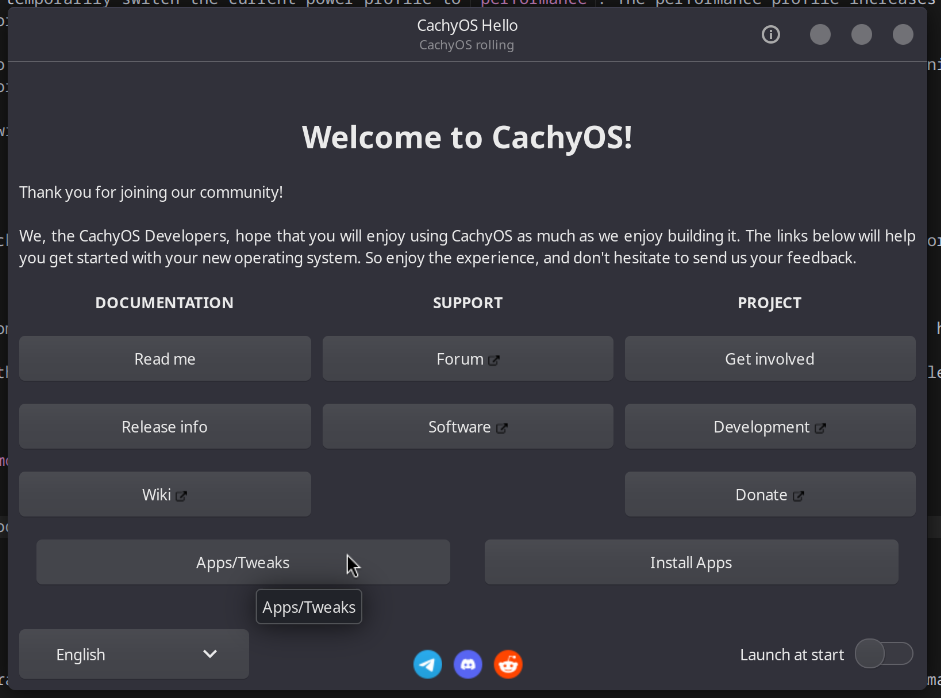
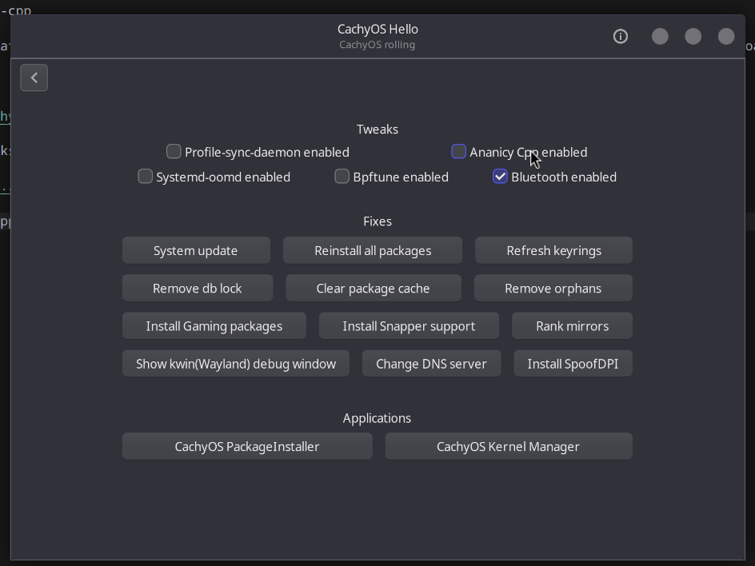

import NavBanner from '@site/src/components/NavBanner';

# Disable / Enable Ananicy Cpp

<NavBanner href="/wiki/cachyos/gaming/about" text="Return to Gaming Guide" />

Ananicy Cpp is a lightweight, event-based process scheduler that automatically optimizes system performance by managing process priorities, CPU scheduling, IO scheduling, and cgroups with minimal resource usage.

## Toggle Ananicy Cpp

1. Open CachyOS Hello.

2. Click on the "Apps/Tweaks" tab.

3. Click on the "Ananicy Cpp enabled" button to toggle it on or off.

It is best to restart your system after disabling or enabling Ananicy Cpp.
