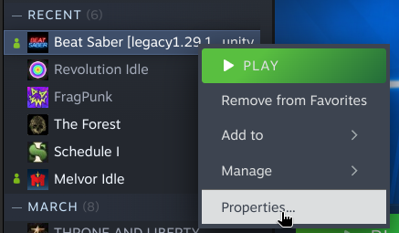
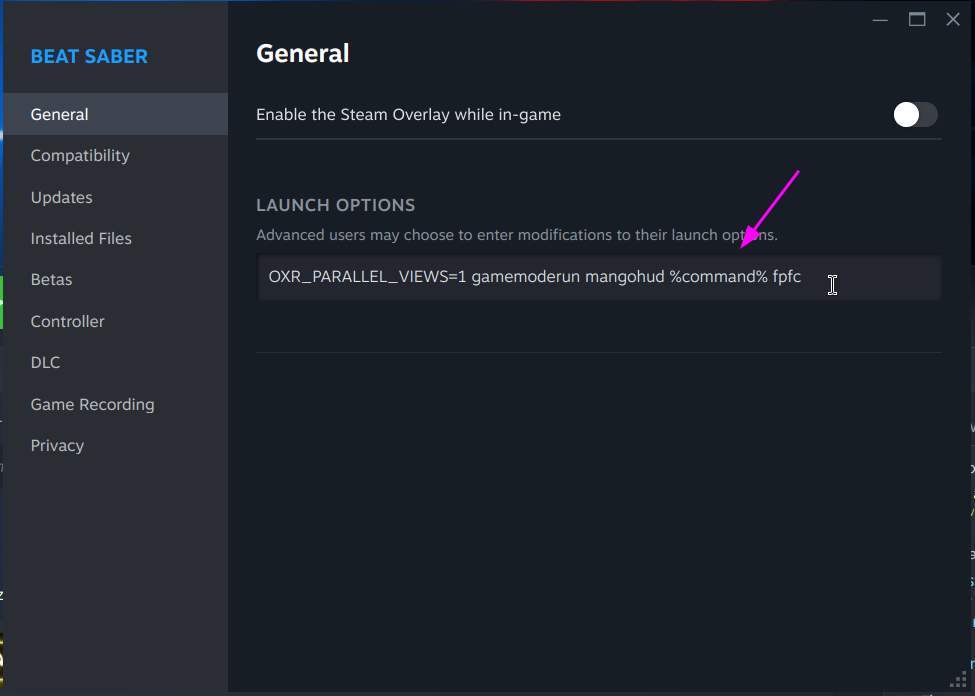

# Configuring Steam

You will need to enable Steam Play to use Proton.

> [Go Home](/wiki/cachyos/gaming/about)

## Enabling Steam Play (Proton)

Steam Play is a feature that allows you to run Windows games on Linux using Proton.

To enable Steam Play inside of Steam, you will need to go to the "Steam" menu and select "Settings".

Then, you will need to go to the "Compatibility" tab and check "Enable Steam Play for all other titles".

## Launch Options

You can add launch options to Steam games to improve performance.

To do this, right-click the game in the Steam library and select "Properties".

Then, you will need to go to the "General" tab.

For example you can enable MangoHud by adding `mangohud %command%` to the launch options.

