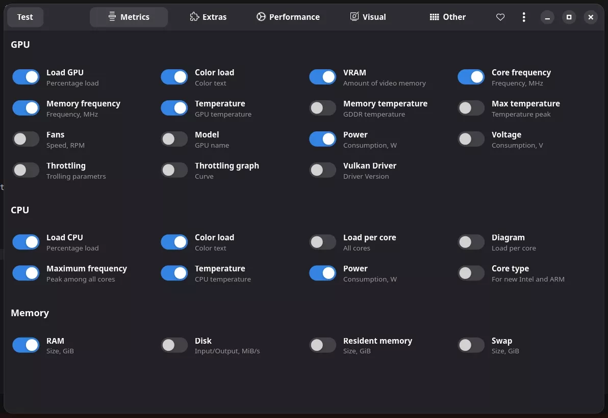

# Performance Monitoring

MangoHud is a powerful performance overlay for Linux that can display FPS, CPU/GPU usage, temperatures, and more.

View the [about section](/wiki/cachyos-gaming/about) for more information about Gaming on CachyOS.

## Installing MangoHud

```bash
yay -S mangohud
```

## Configuring MangoHud

1. Create the config directory and file:
```bash
mkdir -p ~/.config/MangoHud
touch ~/.config/MangoHud/MangoHud.conf
```

2. Edit the config file with your preferred editor:
```bash
nano ~/.config/MangoHud/MangoHud.conf
```

3. Recommended configuration:
<details>
<summary>MangoHud Configuration</summary>

```
legacy_layout=false
blacklist=pamac-manager,lact,ghb,bitwig-studio,ptyxis,yumex
offset_x=10
offset_y=10
gpu_stats
gpu_load_change
vram
gpu_core_clock
gpu_mem_clock
gpu_temp
gpu_power
cpu_stats
cpu_load_change
cpu_mhz
cpu_temp
cpu_power
ram
fps
fps_metrics=avg,0.01
no_display
frame_timing
toggle_logging=Shift_L+F2
toggle_hud_position=Shift_R+F11
fps_limit_method=late
toggle_fps_limit=Shift_L+F1
round_corners=10
background_alpha=0.6
position=top-left
toggle_hud=Shift_R+F12
gpu_text=GPU
gpu_color=2e9762
cpu_text=CPU
cpu_color=2e97cb
fps_value=30,60
fps_color=cc0000,ffaa7f,92e79a
gpu_load_value=60,90
gpu_load_color=92e79a,ffaa7f,cc0000
cpu_load_value=60,90
cpu_load_color=92e79a,ffaa7f,cc0000
background_color=000000
frametime_color=00ff00
vram_color=ad64c1
ram_color=c26693
wine_color=eb5b5b
engine_color=eb5b5b
text_color=ffffff
media_player_color=ffffff
network_color=e07b85
```
</details>

## Using MangoHud

1. **Toggle the overlay**: Press `Shift_R+F12` (Right Shift + F12)
2. **Launch games with MangoHud**: Add to game's launch options in Steam:
```
mangohud %command%
```

## MangoJuice (GUI Configuration)

For a graphical way to configure MangoHud, you can use MangoJuice:

1. Install MangoJuice:
```bash
yay -S mangojuice
```

2. Launch MangoJuice to configure settings visually
3. Use the "Test" button to preview your configuration

