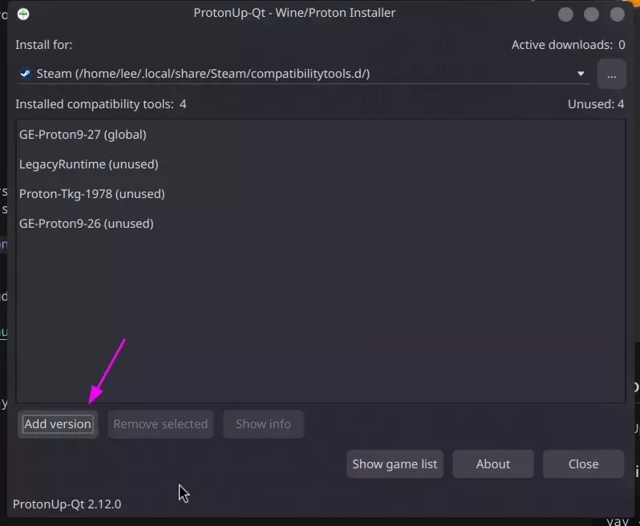

# Proton

In general you shouldn't need to install additional Proton versions, as Steam comes with its own Proton versions. However, if you are looking for additional Proton versions, you can install them using the following methods.

View the [about section](/wiki/cachyos-gaming/about) for more information about Gaming on CachyOS.

## Recommended Proton Versions

- **Proton-GE**: Enhanced version with additional patches and media codecs
- **Proton Experimental**: Latest features and improvements from Valve
- **Proton Hotfix**: Quick fixes for specific games

## Installing Additional Proton Versions

While Steam comes with its own Proton versions, you can install additional versions for better compatibility and performance. There are two popular tools to manage Proton versions:

### Option 1: ProtonPlus (Recommended)

ProtonPlus is a graphical tool for managing Proton versions. I have personally been using this for a while now and it's a great tool.

1. Install ProtonPlus:
```bash
yay -S protonplus
```

2. Open ProtonPlus and select the version you want to install. I recommend installing the latest version of Proton-GE, as can be seen in the screenshot below.


### Option 2: ProtonUp-Qt

ProtonUp-Qt provides a graphical interface for managing Proton versions.

1. Install ProtonUp-Qt:
```bash
yay -S protonup-qt
```

2. Launch ProtonUp-Qt and use the interface to:
   - Click "Add Version"
   - Select "Proton-GE" from the list
   - Choose the latest version
   - Click "Install"




After installing a new Proton version, restart Steam for the changes to take effect.