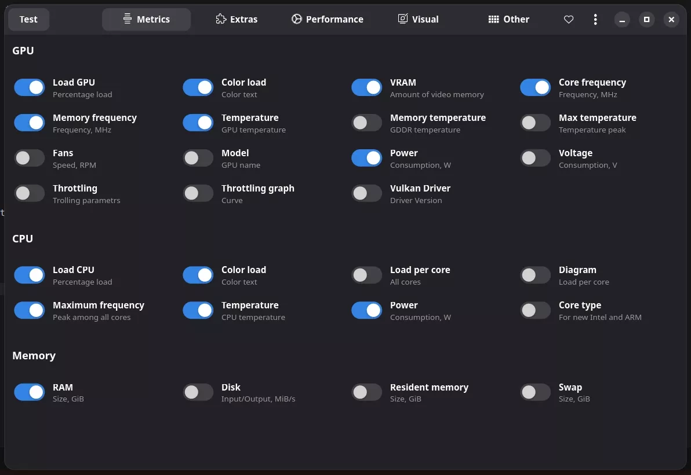

# Gaming on CachyOS using Steam

In this you will learn how to install and use Steam with Proton on CachyOS.

## What is Proton?

[Proton](https://github.com/ValveSoftware/Proton) and it's many forks are a compatibility layer for running Windows games on Linux using Wine.

## Installing Drivers

Insalling additional drivers will ensure that you have the best performance and compatibility with your games. See [here](https://github.com/lutris/docs/blob/master/InstallingDrivers.md) for more information.

### Nvidia

```bash
yay -S nvidia-dkms nvidia-utils lib32-nvidia-utils nvidia-settings vulkan-icd-loader lib32-vulkan-icd-loader
```

### AMD

```bash
yay -S lib32-mesa vulkan-radeon lib32-vulkan-radeon vulkan-icd-loader lib32-vulkan-icd-loader
```

### Intel

```bash
yay -S lib32-mesa vulkan-intel lib32-vulkan-intel vulkan-icd-loader lib32-vulkan-icd-loader
```

*Note: for Intel integrated graphics users: Only Skylake and newer Intel CPUs (processors) offer full Vulkan support. Broadwell, Haswell and Ivy Bridge only offer partial support, which will very likely not work with a lot of games properly. Sandy Bridge and older lack any Vulkan support whatsoever.*

## Installing Steam

If Steam is not already installed, you can install it using:

```bash
yay -S steam
```

## Enabling Steam Play (Proton)

Steam Play is a feature that allows you to run Windows games on Linux using Proton.

To enable Steam Play inside of Steam, you will need to go to the "Steam" menu and select "Settings".


Then, you will need to go to the "Compatibility" tab and check "Enable Steam Play for all other titles".


## Installing Additional Proton Versions

Proton has many different versions, each with their own features and optimizations.

You can easily install these additional versions using [ProtonPlus](https://github.com/Vysp3r/ProtonPlus) or [ProtonUp](https://github.com/AUNaseef/ProtonUp).

### Post Installation

After installing a new version of Proton, you will need to restart Steam.

## ProtonPlus

ProtonPlus is a tool that allows you to easily install and manage Proton versions.

### Installing ProtonPlus

```bash
yay -S protonup
```

### Installing Proton Versions

Open ProtonPlus and select the version you want to install. I recommend installing the latest version of Proton-GE, as can be seen in the screenshot below.


## ProtonUp

ProtonUp is a tool that allows you to easily install and manage Proton versions.

### Installing ProtonUp

```bash
yay -S protonup-qt
```

### Installing Proton Versions

Open ProtonUp and select the version you want to install. I recommend installing the latest version of Proton-GE, as can be seen in the screenshot below.


## Performance Overlays (MangoHud)


### Installing MangoHud

MangoHud is a performance overlay for Linux.

```bash
yay -S mangohud
```

### Configuring MangoHud

Create a config file for MangoHud:

```bash
mkdir -p ~/.config/MangoHud
```

```bash
touch ~/.config/MangoHud/MangoHud.conf
```

Edit the config file:

```bash
nano ~/.config/MangoHud/MangoHud.conf
```

The following is the config file that I use for MangoHud:

<details>
<summary>MangoHud Configuration</summary>

```
legacy_layout=false
blacklist=pamac-manager,lact,ghb,bitwig-studio,ptyxis,yumex
offset_x=10
offset_y=10
gpu_stats
gpu_load_change
vram
gpu_core_clock
gpu_mem_clock
gpu_temp
gpu_power
cpu_stats
cpu_load_change
cpu_mhz
cpu_temp
cpu_power
ram
fps
fps_metrics=avg,0.01
no_display
frame_timing
toggle_logging=Shift_L+F2
toggle_hud_position=Shift_R+F11
fps_limit_method=late
toggle_fps_limit=Shift_L+F1
round_corners=10
background_alpha=0.6
position=top-left
toggle_hud=Shift_R+F12
gpu_text=GPU
gpu_color=2e9762
cpu_text=CPU
cpu_color=2e97cb
fps_value=30,60
fps_color=cc0000,ffaa7f,92e79a
gpu_load_value=60,90
gpu_load_color=92e79a,ffaa7f,cc0000
cpu_load_value=60,90
cpu_load_color=92e79a,ffaa7f,cc0000
background_color=000000
frametime_color=00ff00
vram_color=ad64c1
ram_color=c26693
wine_color=eb5b5b
engine_color=eb5b5b
text_color=ffffff
media_player_color=ffffff
network_color=e07b85
```
</details>

If will be off by default, so you will need to press `Shift_R+F12` (Right Shift + F12) to toggle it.

### Launching Games with MangoHud

To launch a game with MangoHud, you will need to add the following to the game's launch options:

```
mangohud %command%
```

### Using an editor for MangoHud (MangoJuice)

#### Installing MangoJuice

```bash
yay -S mangojuice
```

#### Configuring MangoJuice

Open MangoJuice and configure the settings to your liking.



#### Previewing MangoHud

To preview MangoHud click the "Test" button and a window will open with MangoHud enabled.
*You may need to toggle your overlay using the keybind you set in the config file if it is off by default.*


