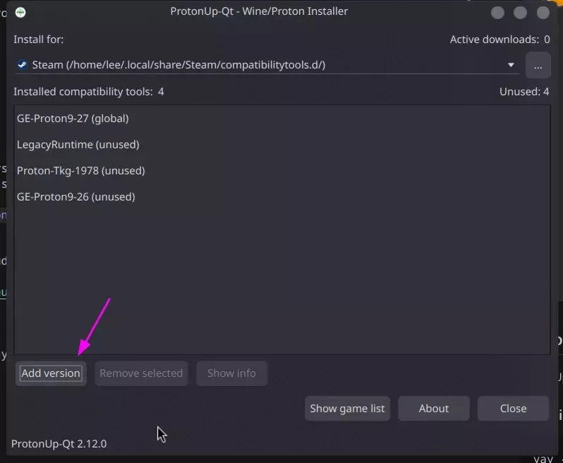
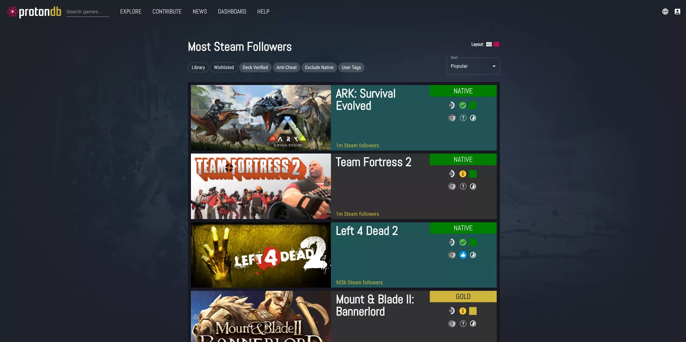

# Gaming on CachyOS using Steam

In this guide, you will learn how to install and use Steam with Proton on CachyOS, along with performance optimization tips and useful tools.

## What is Proton?

[Proton](https://github.com/ValveSoftware/Proton) and it's many forks are a compatibility layer for running Windows games on Linux using Wine.

## Installing Drivers

Insalling additional drivers will ensure that you have the best performance and compatibility with your games. See [here](https://github.com/lutris/docs/blob/master/InstallingDrivers.md) for more information.

### Nvidia

```bash
yay -S nvidia-dkms nvidia-utils lib32-nvidia-utils nvidia-settings vulkan-icd-loader lib32-vulkan-icd-loader
```

### AMD

```bash
yay -S lib32-mesa vulkan-radeon lib32-vulkan-radeon vulkan-icd-loader lib32-vulkan-icd-loader
```

### Intel

```bash
yay -S lib32-mesa vulkan-intel lib32-vulkan-intel vulkan-icd-loader lib32-vulkan-icd-loader
```

*Note: for Intel integrated graphics users: Only Skylake and newer Intel CPUs (processors) offer full Vulkan support. Broadwell, Haswell and Ivy Bridge only offer partial support, which will very likely not work with a lot of games properly. Sandy Bridge and older lack any Vulkan support whatsoever.*

## Installing Steam

If Steam is not already installed, you can install it using:

```bash
yay -S steam
```

## Enabling Steam Play (Proton)

Steam Play is a feature that allows you to run Windows games on Linux using Proton.

To enable Steam Play inside of Steam, you will need to go to the "Steam" menu and select "Settings".


Then, you will need to go to the "Compatibility" tab and check "Enable Steam Play for all other titles".


## Installing Additional Proton Versions

While Steam comes with its own Proton versions, you can install additional versions for better compatibility and performance. There are two popular tools to manage Proton versions:

### Option 1: ProtonPlus (Recommended)

ProtonPlus is a graphical tool for managing Proton versions. I have personally been using this for a while now and it's a great tool.

1. Install ProtonPlus:
```bash
yay -S protonplus
```

2. Open ProtonPlus and select the version you want to install. I recommend installing the latest version of Proton-GE, as can be seen in the screenshot below.


### Option 2: ProtonUp-Qt

ProtonUp-Qt provides a graphical interface for managing Proton versions.

1. Install ProtonUp-Qt:
```bash
yay -S protonup-qt
```

2. Launch ProtonUp-Qt and use the interface to:
   - Click "Add Version"
   - Select "Proton-GE" from the list
   - Choose the latest version
   - Click "Install"




### Recommended Proton Versions

- **Proton-GE**: Enhanced version with additional patches and media codecs
- **Proton Experimental**: Latest features and improvements from Valve
- **Proton Hotfix**: Quick fixes for specific games

After installing a new Proton version, restart Steam for the changes to take effect.

## Performance Monitoring

MangoHud is a powerful performance overlay for Linux that can display FPS, CPU/GPU usage, temperatures, and more.

### Installing MangoHud

```bash
yay -S mangohud
```

### Configuring MangoHud

1. Create the config directory and file:
```bash
mkdir -p ~/.config/MangoHud
touch ~/.config/MangoHud/MangoHud.conf
```

2. Edit the config file with your preferred editor:
```bash
nano ~/.config/MangoHud/MangoHud.conf
```

3. Recommended configuration:
<details>
<summary>MangoHud Configuration</summary>

```
legacy_layout=false
blacklist=pamac-manager,lact,ghb,bitwig-studio,ptyxis,yumex
offset_x=10
offset_y=10
gpu_stats
gpu_load_change
vram
gpu_core_clock
gpu_mem_clock
gpu_temp
gpu_power
cpu_stats
cpu_load_change
cpu_mhz
cpu_temp
cpu_power
ram
fps
fps_metrics=avg,0.01
no_display
frame_timing
toggle_logging=Shift_L+F2
toggle_hud_position=Shift_R+F11
fps_limit_method=late
toggle_fps_limit=Shift_L+F1
round_corners=10
background_alpha=0.6
position=top-left
toggle_hud=Shift_R+F12
gpu_text=GPU
gpu_color=2e9762
cpu_text=CPU
cpu_color=2e97cb
fps_value=30,60
fps_color=cc0000,ffaa7f,92e79a
gpu_load_value=60,90
gpu_load_color=92e79a,ffaa7f,cc0000
cpu_load_value=60,90
cpu_load_color=92e79a,ffaa7f,cc0000
background_color=000000
frametime_color=00ff00
vram_color=ad64c1
ram_color=c26693
wine_color=eb5b5b
engine_color=eb5b5b
text_color=ffffff
media_player_color=ffffff
network_color=e07b85
```
</details>

### Using MangoHud

1. **Toggle the overlay**: Press `Shift_R+F12` (Right Shift + F12)
2. **Launch games with MangoHud**: Add to game's launch options in Steam:
```
mangohud %command%
```

### MangoJuice (GUI Configuration)

For a graphical way to configure MangoHud, you can use MangoJuice:

1. Install MangoJuice:
```bash
yay -S mangojuice
```

2. Launch MangoJuice to configure settings visually
3. Use the "Test" button to preview your configuration


## Game Optimization

### Steam Launch Options

Common launch options to improve game performance:

```
# Enable DXVK async
DXVK_ASYNC=1 %command%

# Force specific GPU (NVIDIA Laptop with Internal GPU and Dedicated GPU)
DRI_PRIME=1 %command%

# Disable shader pre-caching
__GL_SHADER_DISK_CACHE=0 %command%
```

### ProtonDB

[ProtonDB](https://www.protondb.com/) is a database of game compatibility reports for Proton. You can find the best launch options for your game by searching for your game on the website.



### GameMode
GameMode is a daemon/lib combo for Linux that allows games to request a set of optimizations be temporarily applied to the host OS.

1. Install GameMode:
```bash
yay -S gamemode lib32-gamemode
```

2. Launch games with GameMode:
```
gamemoderun %command%
```

## Steam Features

### Family Sharing
1. Go to Steam Settings > Family
2. Authorize a computer for sharing
3. Select which games to share
4. Other users can now play your games when you're offline

### Remote Play Together
1. Right-click a game in your library
2. Select "Remote Play Together"
3. Invite friends to join your game
4. They can play local multiplayer games over the internet

### Steam Cloud
- Automatically syncs save games across devices
- Enable/disable per game in Properties > Updates
- View cloud status in Steam Settings > Cloud

1. Configure in `/etc/gamemode.ini`

## Troubleshooting

### Common Issues

1. **Game Crashes on Launch**
   - Try different Proton versions
   - Verify game files in Steam
   - Check system logs for errors
   - Disable shader pre-caching

2. **Poor Performance**
   - Ensure you have the latest graphics drivers
   - Check if your GPU is being properly utilized
   - Monitor system resources using MangoHud
   - Try different launch options
   - Enable [GameMode](#gamemode)

3. **Audio Issues**
   - Verify PulseAudio or Pipewire is running
   - Check if the game is using the correct audio device
   - Try different audio settings in the game
   - Check for audio device conflicts

## Additional Resources

- [ProtonDB](https://www.protondb.com/) - Check game compatibility and user reports
- [Lutris](https://lutris.net/) - Alternative game manager with additional features
- [WineHQ](https://www.winehq.org/) - Wine documentation and compatibility database
- [Gaming on Linux](https://www.gamingonlinux.com/) - News and guides for Linux gaming
- [Steam Linux Runtime](https://github.com/ValveSoftware/steam-runtime) - Steam's runtime environment
- [DXVK](https://github.com/doitsujin/dxvk) - DirectX to Vulkan translation layer
- [VKD3D-Proton](https://github.com/HansKristian-Work/vkd3d-proton) - DirectX 12 to Vulkan translation layer


